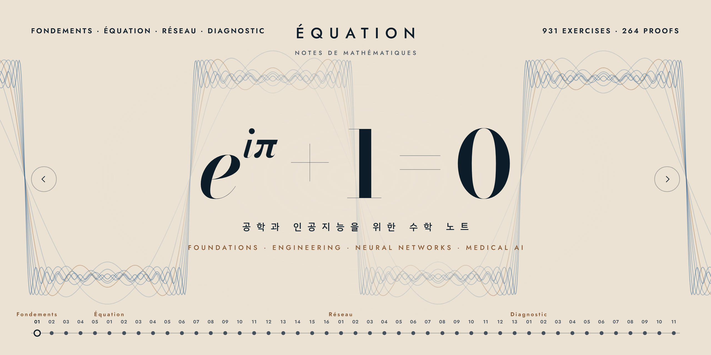

<p align="center"><a href="https://dhsrua555.github.io/equation/"></a></p>

# Équation

공학과 인공지능을 위한 수학 노트입니다. 분야마다 교재와 강의의 순서를 따라 개념 정리·연습문제·증명·모의고사를 두고, 분야 사이는 연결 주석으로 잇습니다.

**사이트:** https://dhsrua555.github.io/equation/

| 분야 | 내용 | 주소 |
|---|---|---|
| 기초 수학 (Fondements) | O 기호·평균값 정리·테일러 정리, 적분의 도구, 급수와 수렴반지름, 다변수 연쇄법칙과 헤시안, 립시츠 조건·부등식·균등수렴. 5단원, 연습문제 38, 증명 21 | [`base/`](https://dhsrua555.github.io/equation/base/) |
| 공학수학 (Équation) | Kreyszig, *Advanced Engineering Mathematics* 10판 1–18장. 16단원, 연습문제 530, 증명 129, 모의고사 4 | [`em/`](https://dhsrua555.github.io/equation/em/) |
| 인공지능 · 심층 신경망 (Réseau) | 심층 신경망의 수학적 기초 1–4주차: 회귀·확률·정보이론, 선형 분류, 역전파와 학습, 하강 보조정리. 13단원, 연습문제 195, 증명 69, 모의고사 3 | [`dnn/`](https://dhsrua555.github.io/equation/dnn/) |
| 인공지능 · 의료 인공지능 (Diagnostic) | 의료 인공지능 및 소프트웨어 시스템: Bishop & Bishop *Deep Learning* 1·2·7·8·9장 — 확률과 베이즈 정리, 가우시안과 최대가능도, 정보이론, 경사하강법과 Adam, 정규화, 역전파, 규제. 11단원, 연습문제 168, 증명 45, 모의고사 3 | [`med/`](https://dhsrua555.github.io/equation/med/) |

예전 주소 `dhsrua555.github.io/engineering-math/`는 공학수학(`em/`)으로 넘어갑니다. 해시(`#ch05-k6.2` 같은 절 주소)도 그대로 따라갑니다.

## 구성

- **허브** (`index.html`) — 분야 목록과 진도, 분야 사이 연결 주석을 그린 연결 지도, 기초 개념이 어디에 쓰이는지, 모든 분야에서 찾기
- **분야** (`<분야>/index.html`) — 개념 정리(절마다 출처 표시), 연습문제(자동 채점·자가 채점), 증명 찾기, 핵심 공식집, 모의고사, 오답노트
- **연결 주석** — 본문에서 `[[ch05:6.2|주석]]`은 같은 분야의 다른 절, `[[@base:ch01:1.3|주석]]`은 다른 분야의 절로 가는 각주가 됩니다. 기초 수학의 각 절 끝에는 다른 분야에서 그 절로 오는 연결이 ‘이 개념을 쓰는 곳’으로 자동으로 모입니다.

설명과 문제는 교재와 강의의 구성을 따라 새로 쓴 것이며 교재의 본문이나 연습문제를 옮기지 않았습니다. 풀이 기록은 분야마다 브라우저의 localStorage에만 저장됩니다.

## 파일 구조

```
index.html            허브
core/app.js           분야 페이지 엔진 (라우팅, 채점, 모의고사, 증명 찾기, 연결 주석)
core/style.css        공통 스타일 (기본 색은 공학수학)   core/hub.css, core/hub.js  허브 전용
core/net.js           분야 목록 (이름, 경로, 저장 키, 공개 여부)
core/net-index.js     분야 사이 제목·링크 색인 (tools/netindex.sh가 생성)
core/net-search.js    허브 검색 색인 (생성)
core/plots.js         단원 표지 그림의 틀   core/calc.js  단답형 계산기   core/katex.css
<분야>/site.js        분야 설정: 이름, 파트, 문구, 저장 키
<분야>/site.env       페이지 제목·설명·글꼴   <분야>/manifest.txt  데이터 파일 순서
<분야>/theme.css      분야의 색과 작은 차이 (선택)
<분야>/plots.js       단원 표지 그림   <분야>/figs.js  본문 SVG 그림 (선택)
<분야>/data/*.js      단원, 연습문제, 증명, 모의고사
tools/build.sh        분야 페이지와 검사 하네스 생성
tools/netindex.sh     전 분야 검사 + 색인 생성 (헤드리스 Chrome)
tools/checks.js       KaTeX 오류, 남은 $, 정답 형식, 증명↔공식 상자, 연결 주석 대상, 모든 라우트 검사
tools/banner.html     배너 원본 (1280×640 → assets/banner.png, assets/og.png)
```

## 고치고 확인하기

```
bash tools/netindex.sh      # 페이지를 다시 만들고, 모든 분야를 검사하고, 색인을 갱신합니다
```

분야마다 `RESULT OK`가 나오면 됩니다. 콘텐츠는 `String.raw` 템플릿이라 `${`를 쓰지 않고, 절 제목에는 `$`를 넣지 않습니다.

**새 분야 추가:** `<분야>/`에 `site.js`, `site.env`, `manifest.txt`, `data/`를 만들고 `core/net.js`의 `NET.fields`에 한 줄 넣은 뒤 `tools/build.sh`와 `tools/netindex.sh`의 `FIELDS`에 이름을 더합니다.

로컬에서 보려면 `index.html`을 브라우저로 열면 됩니다. 수식 렌더링(KaTeX)과 글꼴은 CDN에서 불러오므로 인터넷 연결이 필요합니다.
